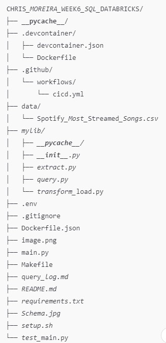
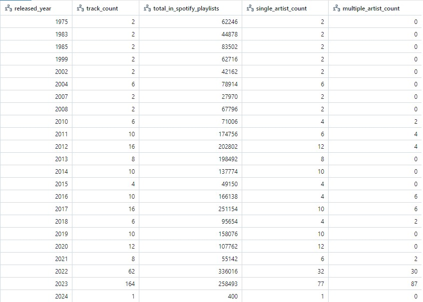
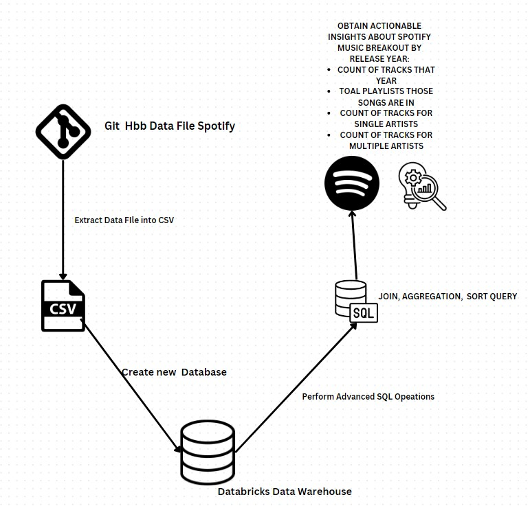

# Command Line Project: Produces a Command Line for the SQL Database that was created in Databricks
# Status Badge for Sucessful Run
[](https://github.com/nogibjj/chris_moreira_command_line/actions/workflows/cicd.yml)

# File Structure 



# Project Purpose
The main file for this project creates a command line that performs the following SQL operations in databricks: extract, transform_data, query the data with a join, aggregaiton and sorting. For further information, please refer to the user_guide.md specified in this repository. 


See below the command line operations in bash:

```bash

python main.py extract

python main.py transform

python main.py query_join

python main.py query_aggregate

python main.py query_sort

```


In this project also we import a csv we work the the Spotify_Most_Streamed Songs csv data. This data is extracted and added into a databricks data lake. Finally A a query is created performs some advances SQL operations for JOINS, Aggregation, and Sorting. The functions are then called, tested and imported into this main directory. The project follows the cicd framework. This framework protects the keys of the server/data lake information that is propietary to the user(myself) and the Duke University. 

# Final Query Output with Spotify Track Insight

# Data Flow map for this project



